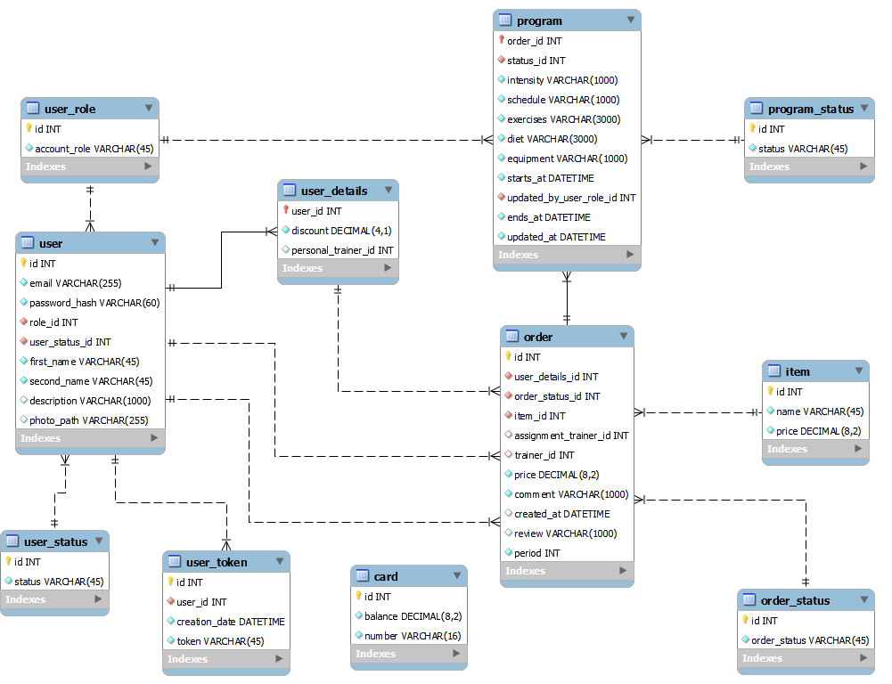

# Fitness Center Final Task
# Project Overview
The web application provides an opportunity to purchase a program for a training cycle.The trainer processes orders, determines the load and mode, makes an program for the client (exercises, shells, nutrition). The client may refuse and/or replace part of the program. The administrator can assign trainers, discounts for regular/corporate clients, add new goods and block/unblock users
## User roles
* Guest
    + Authenticate with login and password
    + Sign up with email confirmation
    + Request email confirmation resend
    + Confirm email via link
    + View goods
* User
    + Make an order
    + Cancel the order
    + Pay for the order
    + View order history
    + View training program
    + Refuse and/or replace part of the training program
    + Write a review
* Trainer
    + Process a new program for the order
    + Edit programm
    + View history of orders with reviews
    + Edit settings(upload new photo, edit description, name)
* Admin
    + Edit user role/status
    + Add/update/remove goods
    + Manage user discounts
## Database diagram

